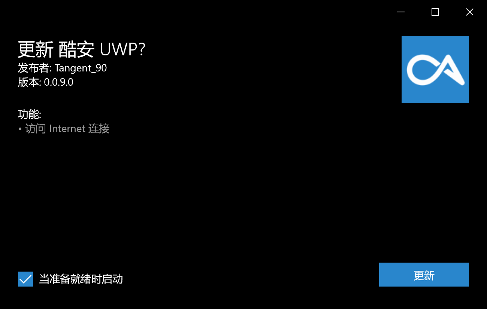
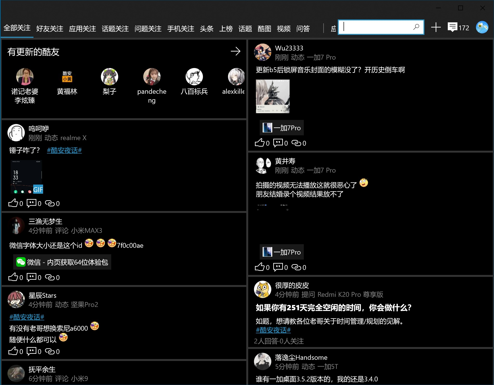
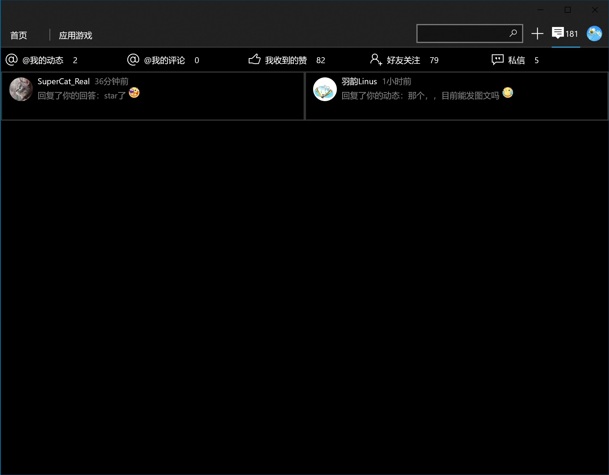
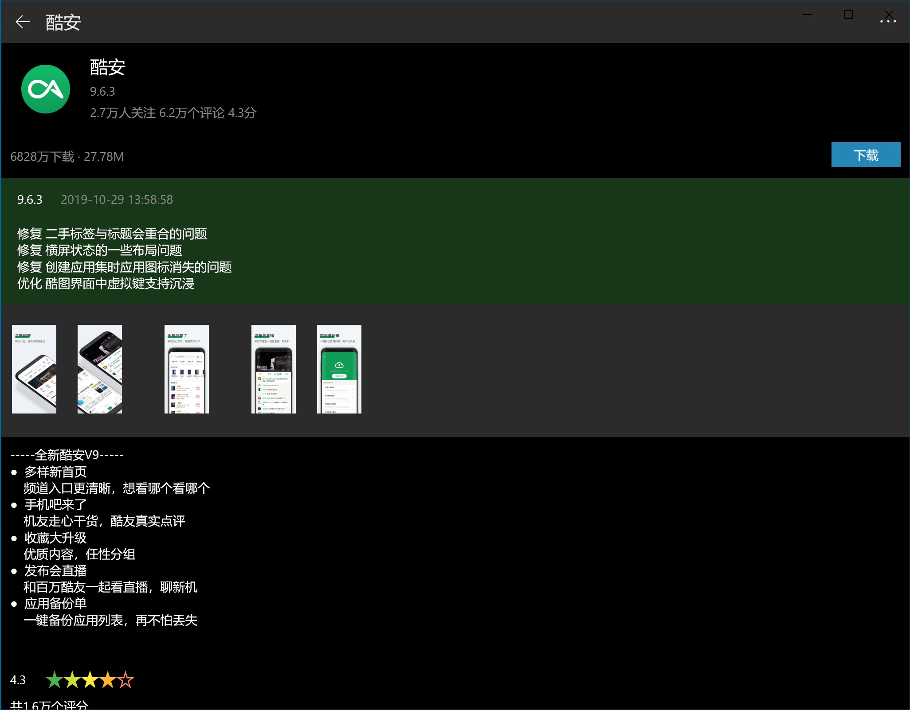

# Coolapk UWP
一个基于UWP的酷安客户端

基于[@一块小板子](http://www.coolapk.com/u/695942)的源码([Github](https://github.com/oboard/CoolApk-UWP))

## 目录
- [现有功能](#现有功能)
- [支持的语言](#支持的语言)
- [如何安装应用](#如何安装应用)
  - [最低需求](#最低需求)
  - [使用应用安装脚本安装应用](#使用应用安装脚本安装应用)
  - [使用应用安装程序安装应用](#使用应用安装程序安装应用)
  - [更新应用](#更新应用)
- [屏幕截图](#屏幕截图)
- [鸣谢](#鸣谢)

## 现有功能
1. 动态磁贴
2. 夜间模式
3. 主题跟随系统
4. 应用内检查更新
5. 登录/发帖/回复/点赞
6. 浏览应用/动态/图文/问答/通知
7. 更多内容请自行发掘🌸🐔

## 支持的语言
中文

## 如何安装应用
### 最低需求
- Windows 10 Build 15063及以上
- 设备需支持ARM/ARM64/x86/x64
- 至少100MB的空余储存空间(用于储存安装包与安装应用)

### 使用应用安装脚本安装应用
- 下载并解压最新的[安装包`(UWP_x.x.x.0_Debug_Test.rar)`](https://github.com/Tangent-90/Coolapk-UWP/releases/latest)
- 如果没有应用安装脚本，下载[`Install.ps1`](Install.ps1)到目标目录

- 右击`Install.ps1`，选择“使用PowerShell运行”
- 应用安装脚本将会引导您完成此过程的剩余部分

### 使用应用安装程序安装应用
- 下载并解压最新的[安装包`(UWP_x.x.x.0_Debug_Test.rar)`](https://github.com/Tangent-90/Coolapk-UWP/releases/latest)
- [开启旁加载模式](https://www.windowscentral.com/how-enable-windows-10-sideload-apps-outside-store)
  - 如果您想开发UWP应用，您可以开启[开发人员模式](https://docs.microsoft.com/zh-cn/windows/uwp/get-started/enable-your-device-for-development)，**对于大多数不需要做UWP开发的用户来说，开发人员模式是没有必要的**
- 安装`Dependencies`文件夹下的适用于您的设备的所有依赖包

- 安装`*.cer`证书到`本地计算机`→`受信任的根证书颁发机构`
  - 这项操作需要用到管理员权限，如果您安装证书时没有用到该权限，则可能是因为您将证书安装到了错误的位置或者您使用的是超级管理员账户
  
  
  
- 双击`*.appxbundle`，单击安装，坐和放宽

### 更新应用
- 下载并解压最新的[安装包`(UWP_x.x.x.0_x86_x64_arm_Debug.appxbundle)`](https://github.com/Tangent-90/Coolapk-UWP/releases/latest)
- 双击`*.appxbundle`，单击安装，坐和放宽

## 屏幕截图
- 启动图

- 首页

- 通知

- 搜索

- 应用游戏

- 应用详情

- 动态

- 图文

- 问答

## 鸣谢
- 酷安UWP原作者[@一块小板子](http://www.coolapk.com/u/695942)([Github](https://github.com/oboard))
- OpenCoolapk作者[@roykio](http://www.coolapk.com/u/703542)([Github](https://github.com/roykio))
- CoolapkTokenCrack作者[@ZCKun](http://www.coolapk.com/u/654147)([Github](https://github.com/ZCKun))
- Coolapk-kotlin作者[@bjzhou](http://www.coolapk.com/u/528097)([Github](https://github.com/bjzhou))
- 以及所有为酷安UWP项目做出贡献的同志们
- **铺路尚未成功，同志仍需努力！**
