# Coolapk UWP
一个基于UWP平台的第三方酷安客户端

基于[@一块小板子](http://www.coolapk.com/u/695942 "一块小板子")的源码([Github](https://github.com/oboard/CoolApk-UWP "oboard"))

## 目录
- [Coolapk UWP](#coolapk-uwp)
  - [目录](#目录)
  - [声明](#声明)
  - [现有功能](#现有功能)
  - [如何安装应用](#如何安装应用)
    - [最低需求](#最低需求)
    - [使用应用安装脚本安装应用](#使用应用安装脚本安装应用)
    - [使用应用安装程序安装应用](#使用应用安装程序安装应用)
    - [更新应用](#更新应用)
    - [一键安装](#一键安装)
  - [屏幕截图](#屏幕截图)
  - [使用到的模块](#使用到的模块)
  - [衍生项目](#衍生项目)
  - [鸣谢](#鸣谢)
  - [Star 数量统计](#star-数量统计)

## 声明
1. 本程序是[酷安](https://coolapk.com)的第三方客户端，仅用作学习交流使用，禁止用于商业用途。
2. 本程序是开源软件，因此，在使用时请确保程序是来自[本Github仓库](https://github.com/Coolapk-UWP/Coolapk-UWP)，以确保您的数据安全。
3. 若程序来源无异常，程序运行过程中您的所有数据都仅用于与酷安的服务器交流或储存于本地，开发者不会窃取您的任何数据。但即便如此，也请注意使用环境的安全性。
4. 若您对[酷安](https://coolapk.com)如何处理您的数据存在疑虑，请访问[酷安用户服务协议](https://m.coolapk.com/mp/user/agreement)、[酷安隐私保护政策](https://m.coolapk.com/mp/user/privacy)、[酷安二手安全条约](https://m.coolapk.com/mp/user/ershouAgreement)。

## 现有功能
1. 夜间模式
2. 登录/点赞
3. 浏览动态/图文/问答/通知
4. 更多内容请自行发掘

## 如何安装应用
### 最低需求
- Windows 10 Build ~~15063~~ 17763及以上
- 设备需支持ARM/ARM64/x86/x64
- Feature2分支支持Windows 10 Build 15035及以上
- 至少100MB的空余储存空间(用于储存安装包与安装应用)

### 使用应用安装脚本安装应用
- 下载并解压最新的[安装包`(CoolapkUWP_x.x.x.0_Test.rar)`](https://github.com/Coolapk-UWP/Coolapk-UWP/releases/latest "下载安装包")
- 如果没有应用安装脚本，下载[`Install.ps1`](Install.ps1)到目标目录

- 右击`Install.ps1`，选择“使用PowerShell运行”
- 应用安装脚本将会引导您完成此过程的剩余部分

### 使用应用安装程序安装应用
- 下载并解压最新的[安装包`(CoolapkUWP_x.x.x.0_Test.rar)`](https://github.com/Coolapk-UWP/Coolapk-UWP/releases/latest "下载安装包")
- [开启旁加载模式](https://www.windowscentral.com/how-enable-windows-10-sideload-apps-outside-store)
  - 如果您想开发UWP应用，您可以开启[开发人员模式](https://docs.microsoft.com/zh-cn/windows/uwp/get-started/enable-your-device-for-development)，**对于大多数不需要做UWP开发的用户来说，开发人员模式是没有必要的**
- 安装`Dependencies`文件夹下的适用于您的设备的所有依赖包

- 安装`*.cer`证书到`本地计算机`→`受信任的根证书颁发机构`
  - 这项操作需要用到管理员权限，如果您安装证书时没有用到该权限，则可能是因为您将证书安装到了错误的位置或者您使用的是超级管理员账户
  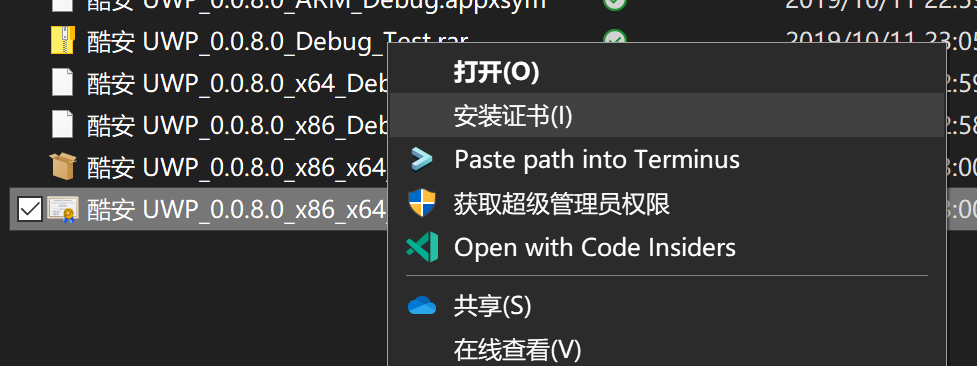
  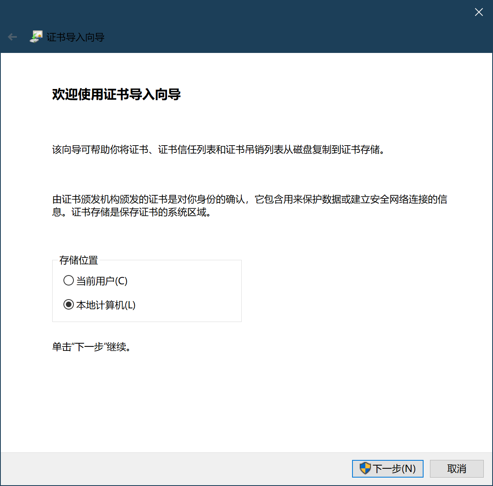
  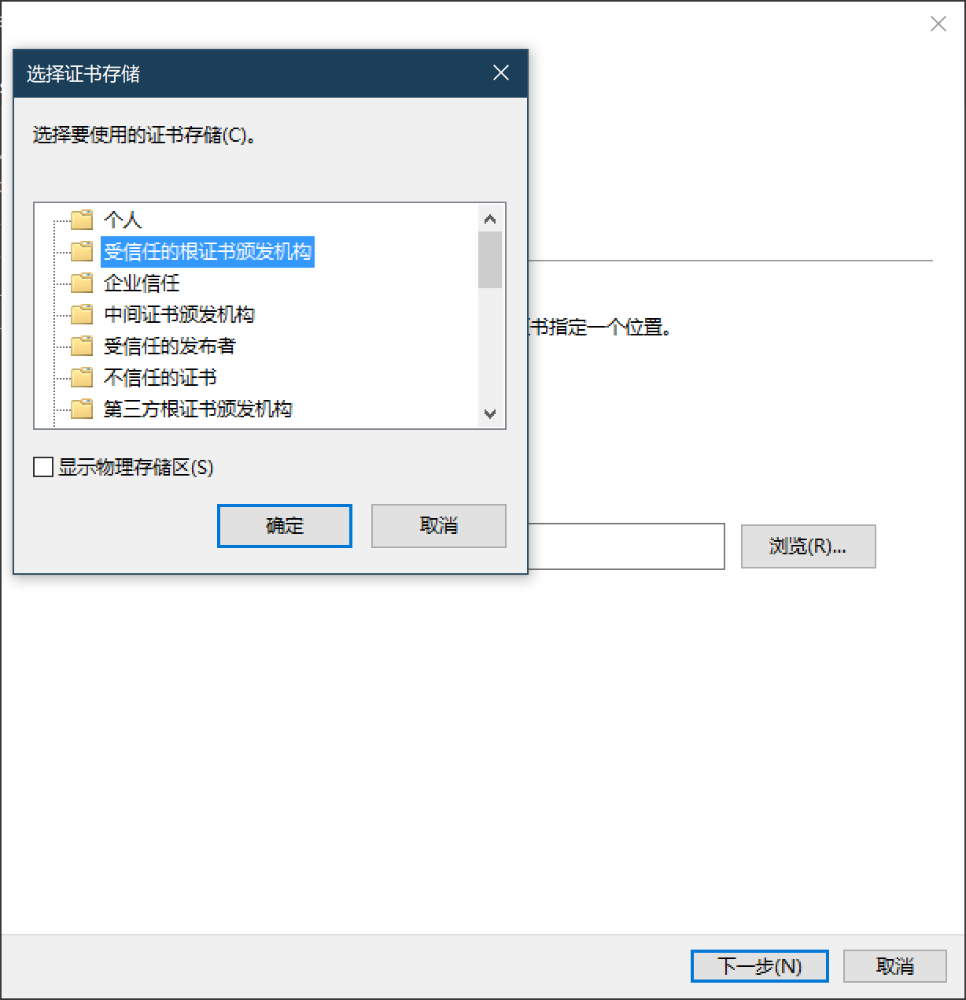
- 双击`*.appxbundle`，单击安装，坐和放宽

### 更新应用
- 下载并解压最新的[安装包`(CoolapkUWP_x.x.x.0_x86_x64_arm_arm64.appxbundle)`](https://github.com/Coolapk-UWP/Coolapk-UWP/releases/latest "下载安装包")
- 双击`*.appxbundle`，单击更新，坐和放宽
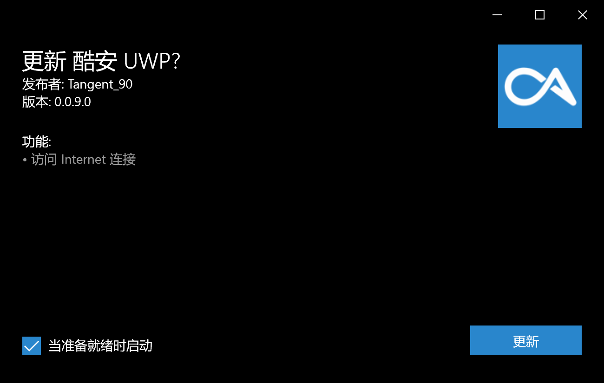

### 一键安装
- 在浏览器中打开链接：`ms-appinstaller:?source=https://raw.fastgit.org/Coolapk-UWP/Coolapk-UWP/screenshots/Appxbundle/CoolapkUWP.appxbundle`
- 弹出窗口后单击打开
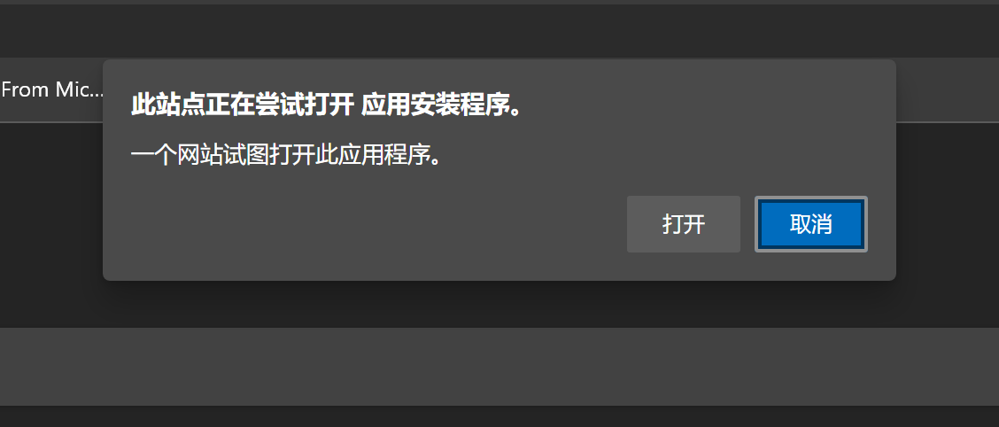
- 单击安装，坐和放宽

## 屏幕截图
- 启动图
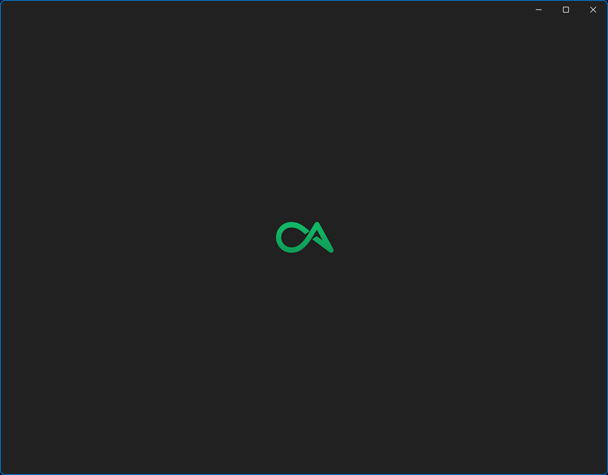
- 首页

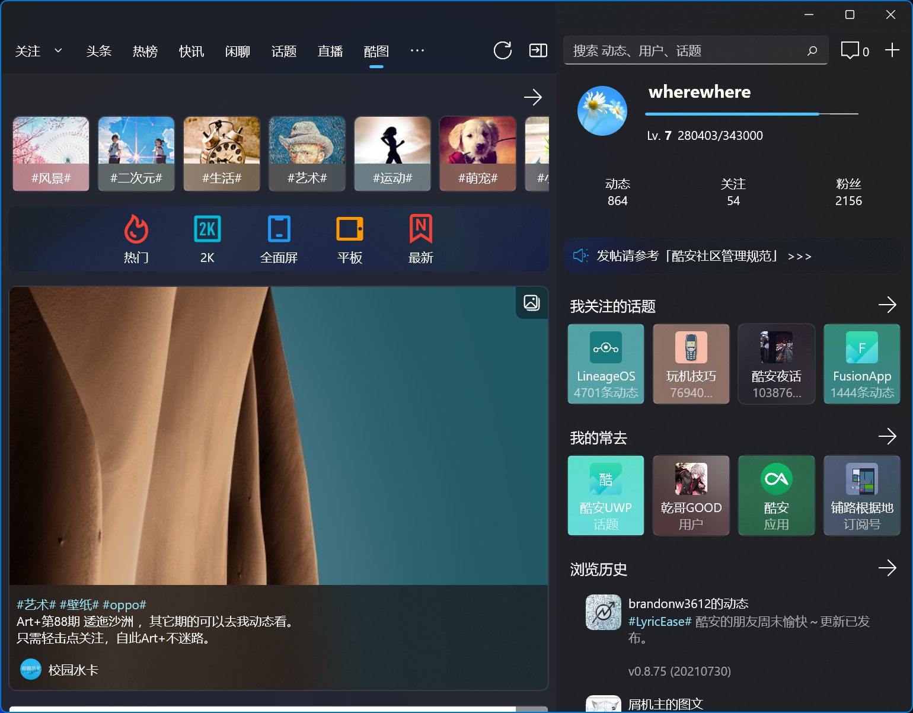
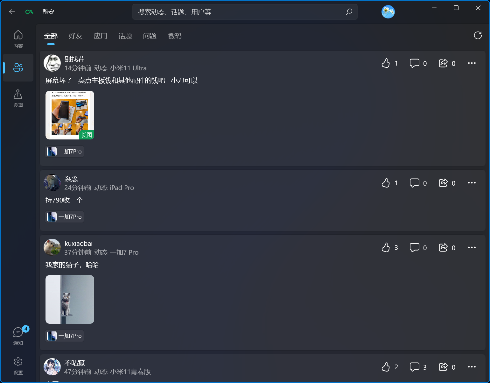
- 通知

- 搜索

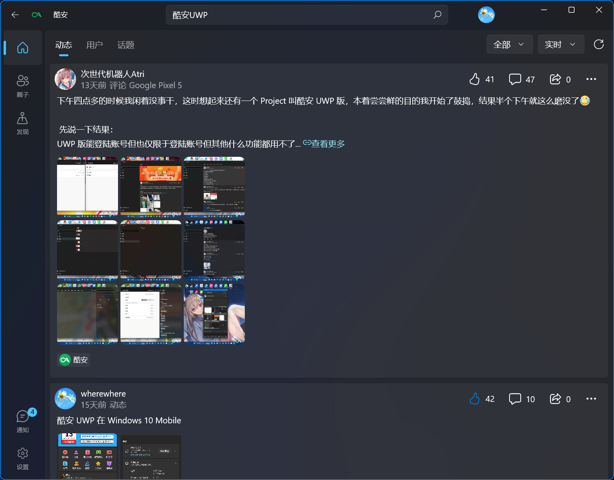
- 应用
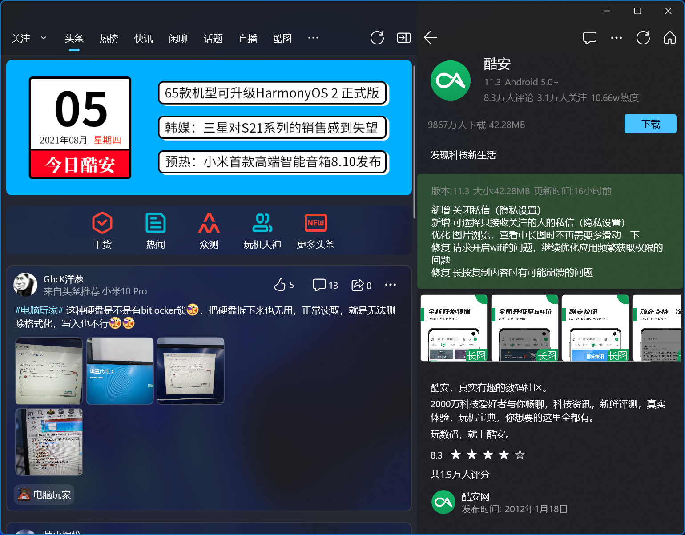
- 动态
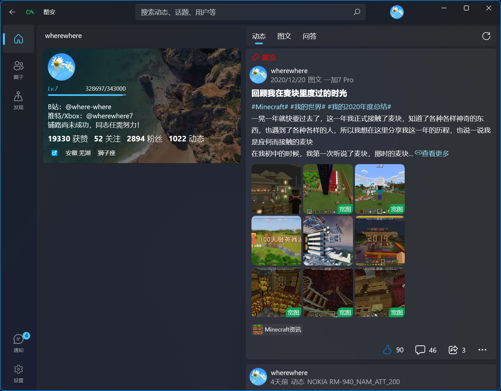
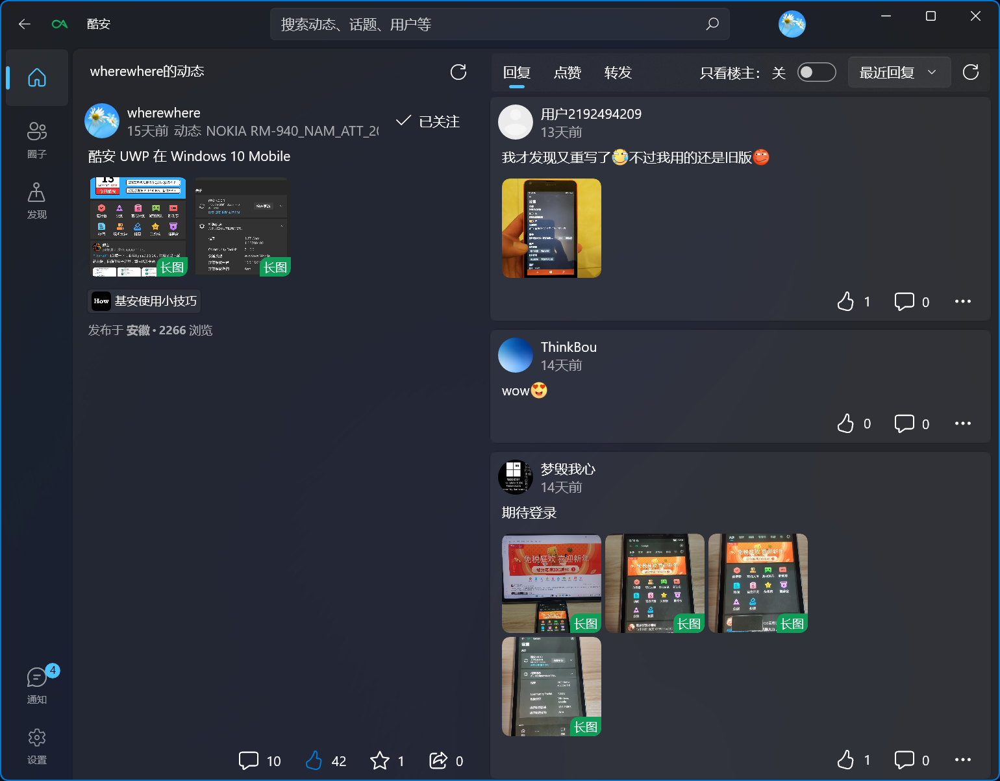
- 图文

- 问答

## 使用到的模块
- [QRCoder](https://github.com/codebude/QRCoder)
- [MetroLog](https://github.com/novotnyllc/MetroLog)
- [Bcrypt.Net](https://github.com/BcryptNet/bcrypt.net)
- [Windows UI](https://github.com/microsoft/microsoft-ui-xaml "Windows UI")
- [Newtonsoft Json](https://www.newtonsoft.com/json)
- [Windows Community Toolkit](https://github.com/CommunityToolkit/WindowsCommunityToolkit "Windows Community Toolkit")

## 衍生项目
- [Coolapk-API-Collect](https://github.com/wherewhere/Coolapk-API-Collect "Coolapk-API-Collect")

## 鸣谢
- 酷安UWP原作者[@一块小板子](http://www.coolapk.com/u/695942 "一块小板子")([Github](https://github.com/oboard "oboard"))
- OpenCoolapk作者[@roykio](http://www.coolapk.com/u/703542 "roykio")([Github](https://github.com/roykio "roykio"))
- CoolapkTokenCrack作者[@ZCKun](http://www.coolapk.com/u/654147 "ZCKun")([Github](https://github.com/ZCKun "0x2h"))
- Coolapk-kotlin作者[@bjzhou](http://www.coolapk.com/u/528097 "bjzhou")([Github](https://github.com/bjzhou "hinnka"))
- 以及所有为酷安UWP项目做出贡献的同志们
- **铺路尚未成功，同志仍需努力！**

## Star 数量统计

